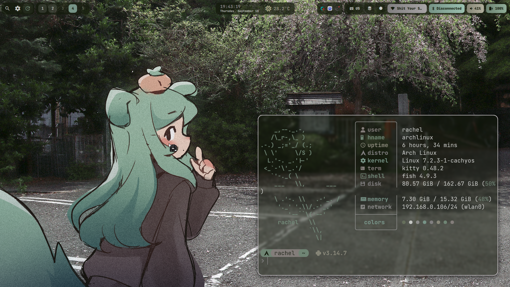
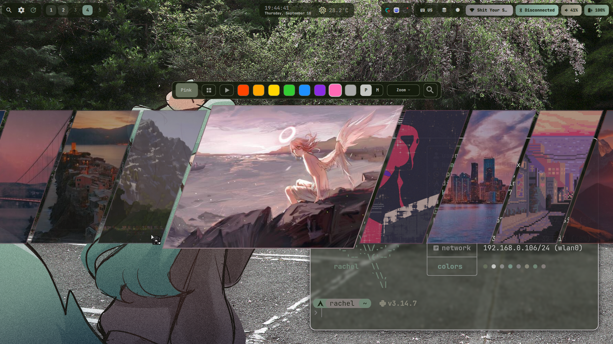
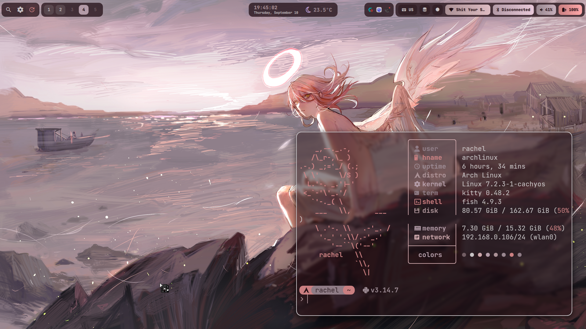

# niri rice thing

stupid fucking rice thing it uses quickshell for niri its kinda neat

## Gallery

Screenshots are kept in [`assets/screenshots`](./assets/screenshots).

<table>
  <tr>
    <td></td>
    <td></td>
    <td></td>
  </tr>
</table>

## Features (ai generated explanation cuz i got lazy as fuckkkkkkkkk)

- Niri config with rounded windows, blur, workspace bindings, and focused-column workflow
- Quickshell top bar, launcher, clipboard, music, volume, network, battery, calendar, wallpaper, settings, and utility panels
- Screenshot overlay with region capture, editing, QR scanning, and recording support
- Pywal/Matugen-backed color generation for Niri and Quickshell
- Kitty config with transparency and generated Pywal colors
- Optional wallpaper collection under `assets/wallpapers`
- Optional Waybar config and helper scripts
- Safe installer with automatic backups and dry-run support
- Automatic installation of missing core dependencies on supported Arch-based systems
- Optional personal and gaming examples kept out of the default install

## Requirements

this shit works only for **arch and arch based distros**.

it does its dependency bs on its own but you can lowk avoid that with `--skip-dependencies`.

see [`docs/DEPENDENCIES.md`](./docs/DEPENDENCIES.md) for the full dependency notes

## Installation

You do **not** need to clone the entire repository first.

Run the interactive installer directly from the README:

```sh
sh -c "$(curl -fsSL https://raw.githubusercontent.com/femgore/niri-quickshell-rice/main/install.sh)"
```

The installer will:

1. Check for and install missing core dependencies.
2. Ask which optional components you want.
3. Download only the repository paths needed for your selection.
4. Back up conflicting existing configuration.
5. Install the selected configuration.

### Optional wallpapers

The wallpaper collection is stored in the repository under:

```text
assets/wallpapers
```

During installation you will be asked whether you want to download it.

If you choose **No**, the wallpaper files are not fetched.

If you choose **Yes**, they are installed to:

```text
~/.config/Wallpapers
```

The installer respects `$XDG_CONFIG_HOME`, so on systems using a custom XDG configuration directory the destination becomes:

```text
$XDG_CONFIG_HOME/Wallpapers
```

### Useful installer options

Preview an installation without changing files:

```fish
./install.sh --dry-run
```

Skip automatic package installation:

```fish
./install.sh --skip-dependencies
```

Show all supported installer options:

```fish
./install.sh --help
```

### Backups

Existing conflicting paths are moved under:

```text
~/.local/state/niri-quickshell-rice/backups/
```

The installer prints the exact backup directory when it finishes.

## Installing from a clone

If you prefer a normal Git checkout:

```fish
git clone https://github.com/femgore/niri-quickshell-rice.git
cd niri-quickshell-rice
./install.sh
```

Be aware that a normal clone may download the wallpaper collection as part of the repository. The one-line installer above is recommended if you do not want the wallpapers.

## Manual Installation

Back up any existing configuration before copying files manually.

```fish
cp -a config/niri ~/.config/niri
cp -a config/quickshell ~/.config/quickshell
cp -a config/kitty ~/.config/kitty

mkdir -p ~/.config/waybar
cp -a config/waybar/scripts ~/.config/waybar/scripts
```

To install the optional wallpapers manually:

```fish
mkdir -p ~/.config
cp -a assets/wallpapers ~/.config/Wallpapers
```

Manual installation does **not** install dependencies for you. See [`docs/DEPENDENCIES.md`](./docs/DEPENDENCIES.md).

## Optional Components

- `optional/gaming/niri/steam-games.kdl` contains disabled Steam/game rules.
- `optional/personal/niri/machine-example.kdl` preserves an example monitor/input/workspace profile.
- `optional/hyprland-compat/` contains intentionally Hyprland-specific material that is not part of the Niri default install.
- `assets/wallpapers/` is optional and is only downloaded by the bootstrap installer when selected.

## Keybindings

See [`docs/KEYBINDS.md`](./docs/KEYBINDS.md).

Important defaults:

| Key | Action |
| --- | --- |
| `Mod+R` | App launcher |
| `Mod+V` | Clipboard |
| `Mod+Shift+W` | Wallpaper picker |
| `Mod+Shift+R` | Region recording |
| `Print` | Screenshot |
| `Mod+H/J/K/L` | Move focus |
| `Mod+Shift+H/J/K/L` | Move window or column |
| `Mod+1..5` | Focus workspace |

## Configuration Layout

See [`docs/CONFIGURATION.md`](./docs/CONFIGURATION.md).

The main files are:

- `config/niri/config.kdl`
- `config/niri/scripts/`
- `config/kitty/kitty.conf`
- `config/quickshell/Shell.qml`
- `config/quickshell/settings.json`
- `config/waybar/scripts/`
- `assets/wallpapers/`
- `assets/screenshots/`

## Customizing Window Rules

Add general rules directly to `~/.config/niri/config.kdl`.

For app-specific rules, copy examples from `optional/gaming/niri/steam-games.kdl` and adjust `app-id`, title matches, sizes, or floating behavior.

Keep hardware-specific output and input settings in a separate local file or clearly marked block so future updates are easier to merge.

## Updating

If you installed from a Git clone, pull the latest changes and rerun the installer:

```fish
git pull
./install.sh --dry-run
./install.sh
```

If you used the one-line installation method, simply run the same command again:

```sh
sh -c "$(curl -fsSL https://raw.githubusercontent.com/femgore/niri-quickshell-rice/main/install.sh)"
```

Review the backup location printed by the installer if local configs already exist.

## Uninstallation

Restore your previous configuration from:

```text
~/.local/state/niri-quickshell-rice/backups/
```

Or remove installed directories manually after backing up any local changes:

```fish
rm -ir ~/.config/niri ~/.config/quickshell ~/.config/kitty
```

If installed, wallpapers are located at:

```text
~/.config/Wallpapers
```

## Troubleshooting

See [`docs/TROUBLESHOOTING.md`](./docs/TROUBLESHOOTING.md).

Validate the Niri config without reloading the desktop:

```fish
niri validate --config ~/.config/niri/config.kdl
```

## Credits

This rice is built around Niri, Quickshell, Waybar, Mako, Pywal/Matugen, and common Wayland utilities.

## License

MIT. See [`LICENSE`](./LICENSE).
